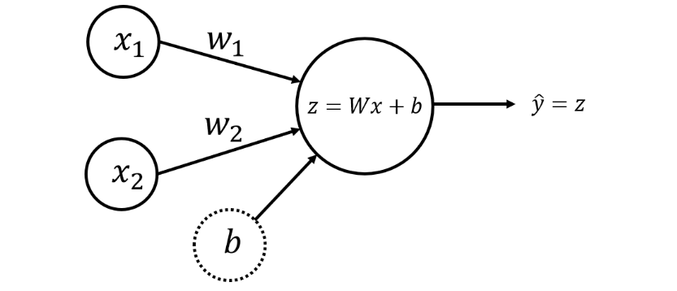

# Neural Network from Scratch

This project provides a simple implementation of a neural network from scratch using NumPy.

## Overview

This neural network implementation includes modules for parameter initialization, forward propagation, backward propagation (gradient descent), and model training. It can be used to train and evaluate a neural network on a variety of datasets.

## Features

- Modular implementation for easy understanding and extension
- Supports customizable network architectures (number of layers, neurons per layer)
- Compatible with classification and regression tasks
- Provides functions for model training, evaluation, and prediction.

The general **methodology** to build a neural network is to:
1. Define the neural network structure ( # of input units,  # of hidden units, etc). 
2. Initialize the model's parameters
3. Loop:
    - Implement forward propagation (calculate the perceptron output),
    - Implement backward propagation (to get the required corrections for the parameters),
    - Update parameters.
4. Make predictions.
